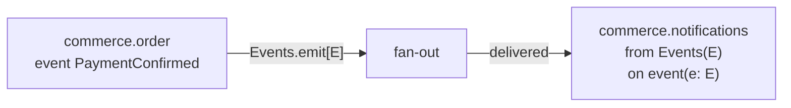

A context sometimes needs to tell other contexts that something happened,
without knowing — or caring — who is listening. Bynk's `event`/`Events`/`from
Events(E)` trio is in-system pub-sub: one context declares a typed fact and
emits it, any number of others subscribe to it, and the compiler — not your
code — wires the delivery.

This page is the mental model for slice 0, the emit/subscribe core. For the
full track's remaining scope (structural filtering on the subscription
header, an envelope, schema versioning, replay), see
[Versioning & roadmap](/book/about/versioning-and-roadmap/).

## The three pieces



- An **`event`** is a typed fact, declared inside a context — a record shape,
  nothing more:

  ```bynk,ignore
  context commerce.order

  exports transparent { PaymentConfirmed }

  event PaymentConfirmed = {
    orderId: String,
  }
  ```

- **`Events`** is the first-party capability that emits one: `Events.emit[E](value)`,
  `given Events` on the handler. Like every generic capability operation
  (`Idempotency.dedup[T]`, for the same reason — see
  [First-party `bynk` capabilities](/book/reference/bynk-capabilities/)), the
  type argument is always explicit, never inferred from `value`'s type.

  ```bynk,ignore
  service markPaid {
    on call(orderId: String) -> Effect[()] given Events {
      Events.emit[PaymentConfirmed](PaymentConfirmed { orderId: orderId })
    }
  }
  ```

- **`from Events(E)`** is a service protocol — the sixth member of the closed
  protocol set alongside `call`/`http`/`cron`/`queue`/`websocket`. A service
  with this protocol has exactly one handler, `on event`, and is not called
  directly; it runs whenever a matching event arrives.

  ```bynk,ignore
  context commerce.notifications

  consumes commerce.order
  consumes bynk { Logger }

  service OnPayment from Events(PaymentConfirmed) {
    on event(e: PaymentConfirmed) -> Effect[()] given Logger {
      Logger.info(e.orderId)
    }
  }
  ```

  Slice 0 has no pattern on the header — every emission of `PaymentConfirmed`
  reaches every subscriber of `PaymentConfirmed`. A subscriber that wants only
  some of them (`from Events(E { region: Domestic, .. })`) is a later slice.

## Only the declaring context may emit

`Events.emit[E]` compiles only when `E` is an event declared **in the emitting
context itself** — even though `E` is visible cross-context for subscription
via the ordinary `consumes` you'd expect (`commerce.notifications` above
`consumes commerce.order` precisely to name `PaymentConfirmed` in its `from
Events(...)` header). A foreign context attempting to emit it fails closed:

```
context commerce.notifications
consumes commerce.order
consumes bynk { Events }

service leak {
  on call() -> Effect[()] given Events {
    Events.emit[PaymentConfirmed](PaymentConfirmed { orderId: "x" })
  }
}
→ [bynk.event.emit_outside_owner] `PaymentConfirmed` is not declared in this
  context — only the context that declares an event may emit it
```

This is deliberate, and new: every other cross-context boundary in Bynk
governs what a context may *name* (`uses`/`consumes`) — this is the first that
restricts what a context may *do* with something it can already see. A type
being subscribable does not make it forgeable.

## Emission is fire-and-forget, and release-at-commit

`Events.emit[E]` returns `Effect[()]` — the emitting handler never learns
whether a subscriber ran, or how it went. What it *does* guarantee: an
emission only ever reaches a subscriber if the emitting handler itself
**committed**. An agent handler that emits and then goes on to violate one of
its own invariants emits nothing — the invariant violation throws before the
event is released, exactly as if `Events.emit` had never been called:

```bynk,ignore
agent Ledger {
  key id: String
  store total: Cell[Int] = 0

  invariant total_stays_small:
    total < 10

  on call bump(amount: Int) -> Effect[()] given Events {
    let _ <- total.update((n) => n + amount)
    do Events.emit[PaymentConfirmed](PaymentConfirmed { orderId: "ledger-event" })
  }
}
```

Calling `bump` with an amount that pushes `total` past `10` throws
`InvariantViolation` — the state write never commits, and the emission above
it never reaches `OnPayment` either. This is not a special case for `Events`:
it is the same all-or-nothing handler-commit boundary agents already have
(store writes vs. invariants), extended to cover an emission raised anywhere
in the same handler body, including one raised inside a plain `service` that
calls into the agent.

## Delivery, concretely, per platform

Slice 0's substrate differs by target, but the emit/subscribe surface above
does not — the same source compiles and runs the same way on every platform:

| Target | Mechanism |
|---|---|
| **Cloudflare Workers** | Each publishing context gets its own compiler-synthesised fan-out Durable Object. One subscriber's delivery failure is caught and logged without blocking delivery to its siblings. Ordering is preserved *within* one emission (everything a single handler invocation emits) and *across* successive, non-overlapping calls to one agent — but **not** across concurrent invocations of the same agent, since the Durable Object delivers by making an outbound call per subscriber and does not serialise two overlapping deliveries against each other. |
| **Bundle** (node, browser) | Dispatch is in-process — no Durable Object, no wire. The composed program calls directly into each subscriber's handler. |

What slice 0 does **not** yet give you: a delivery retry, a durable log to
replay from, or ordering across *concurrent* invocations of the same
publishing agent — measured, not assumed, and found not to hold. A subscriber
that needs a total order across concurrent publishes must carry its own
sequence number in the event payload. A subscriber that must not miss an
event needs its own idempotent handling of "ran zero times" today — the same
discipline any other best-effort delivery already asks for.

**See also:**
[First-party `bynk` capabilities](/book/reference/bynk-capabilities/),
[Understand the capability model](/book/guides/effects-and-capabilities/understand-the-capability-model/),
[Understand: invariants as contracts](/book/guides/agents-and-state/understand-invariants/),
[Diagnostics](/book/reference/diagnostics/).
