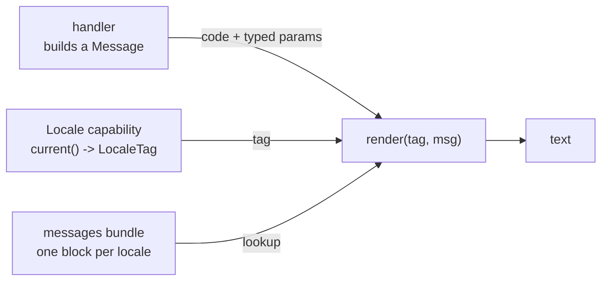

A service that answers real users often has to say something *to* them — a
validation failure, a confirmation, a count. Bynk splits that into two halves
that meet only at the last moment: your code produces a **stable message code
plus typed values**, and a **bundle** turns that into text in a particular
language. Nothing in your handler is written in English, or in any language.

This page is the mental model. For the recipes, see
[Declare a message bundle](/book/guides/localisation/declare-a-message-bundle/)
and [Format with ICU](/book/guides/localisation/format-with-icu/).

## The two halves



- A **`Message`** is `{ code: String, params: Map[String, MessageArg] }` — a
  lookup key and its substitution values. It carries no text.
- A **`LocaleTag`** says which language to render in.
- A **`messages` bundle** maps a code to a template, per locale.
- **`render(tag, msg)`** puts them together.

The split is the point. A handler that returns
`message("order.total.negative")` says *what went wrong* without deciding *how
to say it*, so the same code can be rendered in French, logged untranslated, or
matched on by a caller. Adding a language later touches the bundle and nothing
else.

## `Message` is built, not written

`Message` and `MessageArg` live in `bynk.locale.types`, but you build them with
the functions in `bynk.locale`:

```bynk,ignore
withText(message("order.item.out_of_stock"), "item", "Blue widget")
```

`message(code)` starts an empty one; `withText`, `withWhole`, `withNum` and
`withMoment` add a named value each, one `MessageArg` variant apiece
(`String`, `Int`, `Float`, `Instant`). Building through these functions rather
than a record literal is deliberate — it keeps the values flowing untyped
across a context boundary, sidestepping the per-context type rebrand.

The variant matters: it is what lets a template ask for a *plural* or a
*formatted date* later, rather than a pre-stringified blob. See
[Format with ICU](/book/guides/localisation/format-with-icu/).

## Where the locale comes from

`Locale` is a first-party capability — `consumes bynk { Locale }`, then `given
Locale` on the handler:

```bynk,ignore
on GET("/hello") () -> Effect[HttpResult[String]] given Locale {
  let tag <- Locale.current()
  Ok(greet(tag))
}
```

**Be precise about what `current()` actually returns today**, because it varies
by platform:

| Platform | `Locale.current()` |
|---|---|
| **Cloudflare Workers**, in a context with exactly one detected message bundle | Real `Accept-Language` negotiation (RFC 4647 basic filtering) against the bundle's declared locales, falling back to its reference locale. |
| **Cloudflare Workers**, otherwise | A fixed `"en"`. |
| **Node**, **browser** | A fixed `"en"`. |

So a bundle renders correctly everywhere, but the *negotiation* is currently
Cloudflare-only. On other platforms you can still pass a tag you obtained
yourself — `render` takes the tag as an argument and does not consult the
capability.

## What `render` does when it can't find something

`render` is **total**: it always returns a `String` and never throws. It tries
three rungs in order:

1. The template for `msg.code` in the **resolved tag's own** bundle block.
2. The template for `msg.code` in the **reference locale's** block.
3. The bundle-free floor — `msg.code` itself, plus a deterministic
   key-sorted `{k=v, k=v}` rendering of any params.

Rung 3 means an unknown code degrades to something diagnosable rather than
empty text. Rung 2 means an undeclared locale reads in the reference language
rather than failing.

A placeholder whose key is absent from `params` is left as its literal `{name}`
text — the same principle one level down.

Rung 2 is a *runtime* safety net, not a licence to leave gaps: a locale missing
a code the reference declares is a **compile error**
(`bynk.messages.incomplete`), so the fallback should only ever fire for a
locale the bundle doesn't declare at all.

## `{name}` is ICU, not Bynk

This is the one thing most likely to mislead, so it is worth stating plainly.

Bynk has string interpolation — `"Hello, \(name)"` (ADR 0075). A message
template's `{name}` is **not** that, and the two are not interchangeable:

| | `"…\(expr)…"` | `"…{name}…"` in a template |
|---|---|---|
| What it is | Bynk syntax | [ICU MessageFormat](https://unicode-org.github.io/icu/userguide/format_parse/messages/), a foreign format inside a Bynk string |
| The hole is | any Bynk expression | a name only |
| Resolved against | lexical scope, **where the literal is written** | `msg.params`, **where `render` is called** |
| Resolved when | eagerly, at that point in the code | later, per render, per locale |
| Type-checked | yes, like any expression | no — it is content, matched by name at render time |

They have opposite binding times, which is exactly why they don't share a
spelling. A template is written by (or for) a translator who has no access to
your handler's scope; the only thing it can refer to is a parameter the caller
supplies.

Bynk interpolation inside a template is a **parse error**, not a silent
misbehaviour:

```
"greeting" => "Hello, \(name)"
  → [bynk.parse.expected_token] expected a string literal as a message
    template, found interpolated string
```

The `{…}` spelling is not Bynk's choice — it is ICU's, and Bynk uses it so that
ordinary translation tooling can read and write a bundle's templates without
knowing anything about Bynk.

## What the compiler checks

Bundles are checked as a set, not file by file:

- Exactly **one** `@reference` block per commons
  (`bynk.messages.missing_reference` / `multiple_reference`).
- Every non-reference locale covers **every** code the reference declares —
  one diagnostic per missing code (`bynk.messages.incomplete`).
- A shared code's templates use the **same set** of placeholder names across
  locales, order-insensitively, so a translation may reorder them freely
  (`bynk.messages.placeholder_mismatch`).
- A shared placeholder has the same **ICU format kind** in every locale
  (`bynk.messages.format_mismatch`).
- Templates parse as valid ICU (`bynk.messages.malformed_icu_syntax`).

What it does **not** check: whether the call site that builds a `Message`
actually supplies the parameters a code's template names. `code` is a runtime
`String`, so nothing statically ties a `message("greeting")` call to the
`"greeting"` entry. A missing parameter degrades to its literal `{name}` text
at render time rather than failing the build.

**See also:**
[Declare a message bundle](/book/guides/localisation/declare-a-message-bundle/),
[Format with ICU](/book/guides/localisation/format-with-icu/),
[First-party `bynk` capabilities](/book/reference/bynk-capabilities/),
[Understand the capability model](/book/guides/effects-and-capabilities/understand-the-capability-model/).
