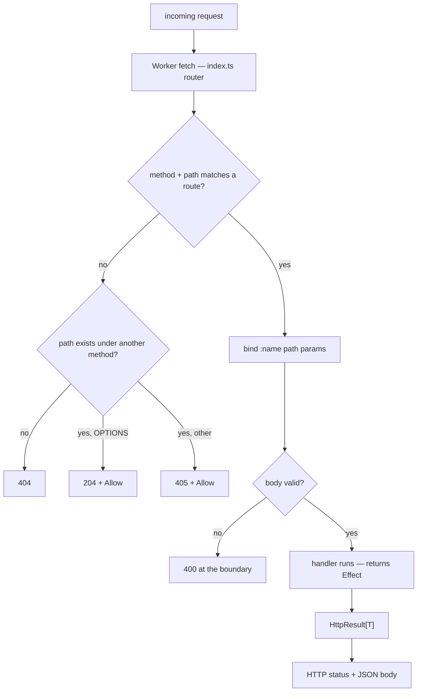

HTTP handlers are declared in a `service` inside a `context`. See the
[grammar for HTTP handlers](/book/reference/grammar/#rule-http_handler) for the production
and the diagnostics that govern it.

## Handler form

```bynk
service <Name> from http {
  on <METHOD>("<route>") (<params>) -> Effect[HttpResult[T]] {
    …
  }
}
```

- **Methods:** `GET`, `POST`, `PUT`, `PATCH`, `DELETE`.
- **Route:** must start with `/`; a `:name` segment is a path parameter.
- **Parameters:** each parameter is either a path parameter (matching a `:name`
  segment) or the special `body` parameter. A path parameter's type must be
  constructible from a string (`bynk.http.path_param_not_stringy`); `GET` and
  `DELETE` may not take a `body` (`bynk.http.body_on_get_or_delete`).
- **Return type:** must be `Effect[HttpResult[T]]`
  (`bynk.http.return_not_effect_http_result`).

> [!DANGER]
> The `/_bynk/` route prefix is reserved for the runtime. Any route under it is
> rejected with `bynk.http.reserved_prefix`.

A `body` parameter is parsed from the request JSON and validated before the
handler runs; an invalid body is rejected with `400` at the boundary.

## `HttpResult` variants

The vocabulary tracks the common, modern HTTP status codes (RFC 9110). A
variant's payload is one of six shapes: the value `T` as JSON (`Value`), a
target URL emitted as a `Location` header (`Location`), an explanatory
`message` as an `{ "error": … }` JSON body (`Message`), a `Stream[String]`
emitted as an SSE (`text/event-stream`) body (`Streamed`), a raw
`Bytes` body under an author-declared `content-type` (`Raw`), or no body at all
(`None`).

### 2xx success

| Variant | Status | Payload |
|---|---|---|
| `Ok(value)` | 200 | the value, as JSON |
| `Streaming(stream)` | 200 | a `Stream[String]`, SSE-framed (see [Streamed responses](#streamed-responses)) |
| `Raw(body, contentType)` | 200 | a `Bytes` body under the given `content-type` (see [Raw responses](#raw-responses)) |
| `Created(value)` | 201 | the value, as JSON |
| `Accepted(value)` | 202 | the value, as JSON |
| `NoContent` | 204 | none |

### 3xx redirection

A redirect carries the target URL, emitted as a `Location` header with an empty
body.

| Variant | Status | Payload |
|---|---|---|
| `MovedPermanently(url)` | 301 | `Location` header |
| `Found(url)` | 302 | `Location` header |
| `SeeOther(url)` | 303 | `Location` header |
| `TemporaryRedirect(url)` | 307 | `Location` header |
| `PermanentRedirect(url)` | 308 | `Location` header |

### 4xx client error

| Variant | Status | Payload |
|---|---|---|
| `BadRequest(message)` | 400 | message |
| `Unauthorized` | 401 | none |
| `Forbidden` | 403 | none |
| `NotFound` | 404 | none |
| `MethodNotAllowed` | 405 | none |
| `NotAcceptable` | 406 | none |
| `RequestTimeout` | 408 | none |
| `Conflict(message)` | 409 | message |
| `Gone` | 410 | none |
| `LengthRequired` | 411 | none |
| `PayloadTooLarge(message)` | 413 | message |
| `UnsupportedMediaType(message)` | 415 | message |
| `UnprocessableEntity(message)` | 422 | message |
| `TooManyRequests(message)` | 429 | message |
| `UnavailableForLegalReasons(message)` | 451 | message |

### 5xx server error

| Variant | Status | Payload |
|---|---|---|
| `ServerError(message)` | 500 | message |
| `NotImplemented(message)` | 501 | message |
| `BadGateway(message)` | 502 | message |
| `ServiceUnavailable(message)` | 503 | message |
| `GatewayTimeout(message)` | 504 | message |

> [!TIP]
> When `Ok`/`Err` could mean either `Result` or `HttpResult`, qualify the
> constructor (e.g. `HttpResult.Ok(…)`) to resolve
> `bynk.types.ambiguous_constructor`.

## Method semantics

The methods a path answers are **derived from the routes you declare** — there is
nothing to write. For a service declaring `POST /links` and `GET /links/:code`,
the router synthesises, from that table alone:

| Request | Answer |
|---|---|
| `GET /links` (a live path, wrong method) | `405` with `Allow: OPTIONS, POST` |
| `OPTIONS /links` (a plain, non-preflight `OPTIONS`) | `204` with `Allow: OPTIONS, POST` |
| `HEAD /links/:code` | the `GET` status and headers, with an empty body |
| `OPTIONS /links/:code` | `204` with `Allow: GET, HEAD, OPTIONS` |
| `DELETE /links/:code` (wrong method) | `405` with `Allow: GET, HEAD, OPTIONS` |
| `GET /nope` (no such path) | `404` — unchanged |

The **allowed-method set** for a path is the union of the methods declared on it,
plus `OPTIONS` always, plus `HEAD` whenever `GET` is present. So:

- **`405 + Allow`** — a request to a *live* path with an undeclared method is a
  `405` (not a `404`), carrying the derived `Allow` header (RFC 9110 §15.5.6). A
  request to a path that does not exist is still a `404`.
- **`OPTIONS`** — a plain (non-preflight) `OPTIONS` to a known path is a `204`
  carrying `Allow`. (A CORS preflight — an `OPTIONS` bearing
  `Access-Control-Request-Method` — is answered by the [CORS](#cors) machinery
  instead, with the `Access-Control-*` grant.)
- **`HEAD`** — a `HEAD` to a `GET` route runs the `GET` handler and returns its
  status and headers with an empty body (RFC 9110 §9.3.2). Because the handler
  runs, the headers are exactly a `GET`'s; a `Streaming` `GET` answered as `HEAD`
  returns the stream's headers without draining it. `content-length` is omitted
  (the body is never materialised — permitted).

`HEAD` and `OPTIONS` are **not** declarable methods — there is no `on HEAD`/`on
OPTIONS` to write; they are synthesised. This is a router correctness property
with no configuration and no "off": every `from http` service answers its method
contract. The `405`/`OPTIONS` answers are produced **before** the `by`/Bearer
auth seam (method discovery and method rejection are credential-less); a `HEAD`
runs the `GET` handler and so runs `GET`'s auth seam unchanged.

> [!NOTE]
> The synthesised `405` is a **router** response and always carries `Allow`. The
> author-returnable `MethodNotAllowed` variant (the table above) is a distinct,
> deliberate deny an author writes from a handler; it stays bodyless with no
> `Allow` header.

## Caching

A `GET` response splits into two halves — a **validator** (has this changed?) and
a **freshness window** (is stale data acceptable, and for how long?). The validator
is derivable from the bytes the handler already produces, so the compiler
synthesises it; the freshness window is a judgement only you can make, so you
declare it. Nothing else.

### Automatic revalidation (`ETag` / `304`)

Every **eligible `GET`** — one returning the JSON `Ok` variant — carries a
synthesised weak [`ETag`](https://developer.mozilla.org/en-US/docs/Web/HTTP/Headers/ETag)
over its serialised body. When a client re-requests with a matching
`If-None-Match`, the router answers **`304 Not Modified`** with an empty body,
saving the transfer. This is on by default, with nothing to write:

| Request | Answer |
|---|---|
| `GET /links/:code` (first call) | `200` + body + `ETag: W/"…"` |
| `GET /links/:code`, `If-None-Match: W/"…"` (unchanged) | **`304`**, empty body, same `ETag` |
| `GET /links/:code`, a stale `If-None-Match` | `200` + body + the new `ETag` |

Only the `Ok` variant is eligible — `Streaming`, `Raw`, redirects, and error
variants carry no `ETag` and are never answered `304` (a stream has no hashable
body; the rest have no representation to validate). The validator is **weak**
(`W/"…"`): it asserts *semantic* equivalence of the representation, which is what
revalidation needs. Because it is a content hash, a `304` still runs the handler
and serialises the body — it saves **bandwidth, not server work**. A cheaper
validator that short-circuits before the handler (e.g. a `Last-Modified` from a
store timestamp) is a planned follow-on.

The `304` is a **router** response synthesised from the request, not an
`HttpResult` variant — there is no `NotModified` to return. Like the CORS
preflight, it is stamped with `Access-Control-Allow-Origin` for a CORS service, so
a cross-origin revalidation stays readable by the browser.

### Declared freshness (`@cache`)

To let a client or CDN serve a response **without revalidating** for a window,
annotate the handler with `@cache`, written immediately before `on GET`:

```bynk
service links from http {
  @cache(maxAge: 5.minutes)
  on GET("/links/:code") by v: Visitor (code: Slug) -> Effect[HttpResult[Url]] given Kv { … }
}
```

This emits `Cache-Control: private, max-age=300` alongside the automatic `ETag`.
`@cache` is the **first handler-position annotation**; it is legal only on a `GET`
handler returning `Ok`.

| Field | Meaning | Default |
|---|---|---|
| `maxAge` | The freshness window, as a [`Duration`](/book/reference/types/#duration) — emitted as `Cache-Control: max-age` in whole seconds. **Required.** | — |
| `scope` | `public` or `private`. `private` lets only a client's own cache store the response; `public` also lets a **shared** cache / CDN store it. | `private` |

The `private` default is the safe one: a shared cache never stores a response
unless you opt into `public`. A `GET` with no `@cache` still carries its `ETag`
(so it is revalidatable) but emits no `Cache-Control`. Duration units are plural —
`5.minutes`, `1.hours`, `30.seconds` — so a singular `1.hour` is a
`bynk.http.cache_bad_max_age` diagnostic; `@cache` on a non-`GET` (or streaming)
handler is `bynk.http.cache_on_non_get`.

## Streamed responses

`Streaming(stream)` returns a **200** whose body is a [`Stream[String]`](/book/reference/types/#stream),
emitted as Server-Sent Events (`content-type: text/event-stream`). Each stream
element becomes one SSE event — `data: <element>\n\n` — so a handler can send an
incremental feed without buffering the whole response:

```bynk
on GET("/ticks") by v: Visitor () -> Effect[HttpResult[()]] {
  Streaming(Stream.of(["tick-1", "tick-2", "tick-3"]).take(3))
}
```

A streamed handler returns `Effect[HttpResult[()]]` — the JSON body parameter
`T` is unused, since the body is the stream. **A response commits its status and
headers before the first chunk**, so streaming is **200-only**: handle a
pre-stream failure by returning an ordinary variant *instead* of `Streaming`
(`NotFound`, `Unauthorized(…)`, …), which share `HttpResult[()]` and so sit in
the same handler with no type conflict:

```bynk
on GET("/feed/:mode") by v: Visitor (mode: String) -> Effect[HttpResult[()]] {
  if mode == "live" {
    Streaming(Stream.of(events).take(100))
  } else {
    NotFound
  }
}
```

## Raw responses

`Raw(body, contentType)` returns a **200** whose body is a raw
[`Bytes`](/book/reference/types/#bytes), written straight into the response under
the `content-type` you give — **no codec runs**. This is the service-tier escape
hatch for non-JSON bodies: `robots.txt`, `sitemap.xml`, `.well-known` documents,
RSS/Atom feeds, a CSV download, a QR-code PNG. Bynk serves *bytes with a
content-type*; it does **not** template HTML (that is the frontend tier).

`Bytes` is binary-first, so a PNG flows in directly and text goes through
`Bytes.fromUtf8` — which makes the UTF-8 charset an explicit author decision
rather than a runtime guess:

```bynk
on GET("/sitemap.xml") by v: Visitor () -> Effect[HttpResult[()]] {
  let xml = "<?xml version=\"1.0\"?><urlset></urlset>"
  Raw(Bytes.fromUtf8(xml), "application/xml")
}
```

Like `Streaming`, `Raw` returns `Effect[HttpResult[()]]` — the JSON body
parameter `T` is unused — and is **200-only**: it serves service-tier bodies,
which are overwhelmingly `200`. A custom-status raw body (a `404` with an HTML
error page) is a presentation concern held out of scope; a `Raw` branch and an
ordinary pre-body variant share `HttpResult[()]`, so they coexist in one handler.

The `content-type` is an opaque `String`, unvalidated — you own it. If you write
`Bytes.fromUtf8(s)`, the body is UTF-8, so a `content-type` claiming a different
charset would mislead; keep them in step.

A producer that can fail mid-stream carries its outcome in-band — build a
`Stream[Result[String, E]]` and `.map` it to `Stream[String]`, encoding an `Err`
as an error event — because the HTTP status is already sent once streaming
begins. A bounded `take` is the language-level guard against an unbounded
response. A structured event type (named `event`/`id`/`retry` fields) is a
planned follow-on; v1 streams plain `String` events.

## CORS

A `from http` service is **same-origin** by default: a browser page served from a
different origin cannot read its responses. A cross-origin preflight is answered
(a plain `OPTIONS` gets `204 + Allow` — see [Method semantics](#method-semantics)),
but *without* the `Access-Control-*` grant, so the browser still blocks the read.
To make a service **cross-origin callable**, declare a `cors { }` policy in header
position — before the routes:

```bynk
service api from http {
  cors {
    origins:     ["https://app.example.com"],
    credentials: false,
    maxAge:      1.hours,
  }

  on GET("/items/:id") by v: Visitor (id: Slug) -> Effect[HttpResult[Item]] given Kv { … }
}
```

From this the compiler synthesises, for that service:

- an **`OPTIONS` preflight** against any of its route paths — answered with `204` and
  the `Access-Control-*` headers, **before** the `by`/Bearer auth seam (a preflight is
  credential-less by spec, so it must not be rejected by an actor check); and
- **`Access-Control-Allow-Origin`** (plus `Vary: Origin`) stamped onto **every**
  response of the service — uniformly across the `Ok`/`Raw`/redirect/error/stream
  variants.

### Fields

| Field | Meaning | Default |
|---|---|---|
| `origins` | The allowed origins, as string literals — an exact allowlist (`["https://a.com", "https://b.com"]`), or the wildcard `["*"]`. **Required.** | — |
| `headers` | The `Access-Control-Allow-Headers` a preflight advertises. | `content-type` (plus `authorization` when the service has a [Bearer](/book/reference/actors/) route) |
| `credentials` | Whether credentialed requests (cookies / `Authorization`) are allowed — sends `Access-Control-Allow-Credentials: true`. | `false` |
| `maxAge` | How long a browser may cache the preflight, as a [`Duration`](/book/reference/types/#duration) — sent as `Access-Control-Max-Age` seconds. | omitted (browser default) |

`Access-Control-Allow-Methods` is **not** a field: it is **derived from the service's
routes** (their methods, plus `HEAD` where `GET` is present, plus `OPTIONS`) — the same
derivation that drives the [`Allow` header](#method-semantics) — so it can never drift
from what the service actually serves.

### Origin matching

An exact allowlist compares the request's `Origin` and **reflects** the matched value
(it never echoes an unvalidated origin), adding `Vary: Origin` so a shared cache does
not serve one origin's grant to another. A request from an origin not on the list gets
**no** `Access-Control-Allow-Origin` — the browser blocks the read (fail closed). The
wildcard `["*"]` answers every origin with a literal `*` (and needs no `Vary`).

### The credentials + wildcard rule

The Fetch spec forbids `Access-Control-Allow-Credentials: true` alongside a wildcard
origin — a browser rejects that combination at runtime. Bynk catches it at **compile
time** (`bynk.http.cors_wildcard_credentials`): with `credentials: true`, list the exact
origins instead of `["*"]`.

A `cors { }` block is only valid on a `from http` service
(`bynk.http.cors_not_http`), and a service declares at most one.

## Request lifecycle



*Validation happens once, at the edge; the handler only ever sees valid input.*

Text equivalent: the Worker's `fetch` entry point (`index.ts`) routes the request
on method **and** path. On a match, path parameters are bound and any `body` is
parsed and validated against its refined type — an invalid body is rejected with
`400` at the boundary, before the handler runs. The handler then runs as an
`Effect` and returns an `HttpResult[T]`, which is mapped to an HTTP status and
JSON body per the table above. When no route matches, a request to a *live* path
under an unhandled method is a `405 + Allow` (or `204 + Allow` for a plain
`OPTIONS`); only a request to a path that exists under **no** method is a `404`
(see [Method semantics](#method-semantics)).

## Example

```bynk
context notes

service api from http {
  on GET("/ping") by Visitor () -> Effect[HttpResult[String]] {
    Ok("pong")
  }

  on GET("/notes/:id") by Visitor (id: String) -> Effect[HttpResult[String]] {
    NotFound
  }
}
```

## Emission

`from http` services compile to a runnable Cloudflare Worker on the `--target
workers` target (`index.ts` router, `handlers.ts`, `compose.ts`,
`wrangler.toml`). See [emission](/docs/emission/) and
[Target Cloudflare Workers](/book/guides/projects-build-and-deployment/cloudflare-workers/).
